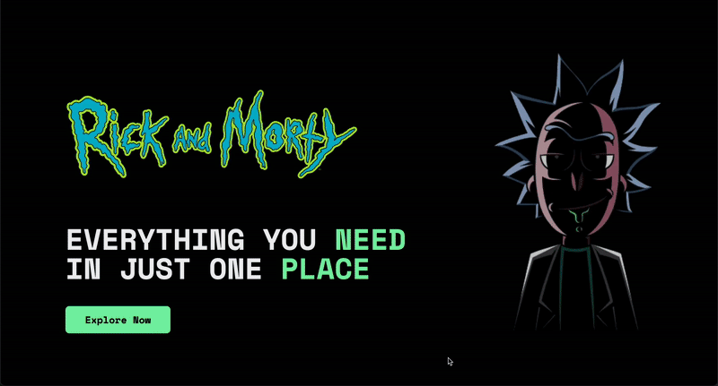

# Rick and Morty Explorer

A Next.js application that allows users to explore the Rick and Morty universe, featuring characters, episodes, and locations from the show.

## Features

- 🎬 Browse all episodes with season organization
- 👥 Explore detailed character information
- 📍 Discover various locations from the series
- ❤️ Save favorite characters and episodes
- 📱 Fully responsive design
- 🎨 Modern UI with animations and transitions

## Tech Stack

- **Framework**: Next.js 14 with App Router
- **Language**: TypeScript
- **Styling**: Tailwind CSS
- **State Management**:
  - Jotai for global state
  - React Query for server state
- **UI Components**:
  - Shadcn/ui
  - Framer Motion for animations
- **Development**:
  - Storybook for component development
- **API**: Rick and Morty API

## Getting Started

1. Clone the repository:

```bash
git clone https://github.com/jaddesuarez/rick_and_morty_wiki.git
```

2. Install dependencies:

```bash
npm install
# or
yarn install
```

3. Run the development server:

```bash
npm run dev
# or
yarn dev
```

4. Open [http://localhost:3000](http://localhost:3000) in your browser.

## Storybook

This project uses Storybook for component development and documentation. To run Storybook:

```bash
npm run storybook
# or
yarn storybook
```

Then open [http://localhost:6006](http://localhost:6006) to view the component library.

Each component is documented with:

- Different states and variations
- Interactive controls for props
- Code snippets
- Component documentation

## Project Structure

```
src/
├── app/              # Next.js app router pages
├── lib/
│   ├── config/       # API config
│   ├── context/      # Jotai atoms and context
│   ├── hooks/        # Custom React hooks
│   ├── interfaces/   # TypeScript interfaces
│   ├── middlewares/  # Middlewares
│   ├── services/     # Services
│   ├── utils/        # Utility functions
└──  ui/
   ├── components/   # Reusable UI components
   ├── layouts/      # Layout components
   ├── styles/       # Global styles
   └── views/        # Page-specific components
```

## Features in Detail



### Episodes

- Browse episodes by season
- View episode details including characters
- Save favorite episodes
- Add reviews and ratings

### Characters

- View detailed character information
- See character status and origin
- Browse episodes featuring the character
- Save favorite characters

### Locations

- Explore different locations
- View residents of each location
- Get detailed location information

## Acknowledgments

- [Rick and Morty API](https://rickandmortyapi.com/) for providing the data
- [Next.js](https://nextjs.org/) for the amazing framework
- [Tailwind CSS](https://tailwindcss.com/) for the styling system
